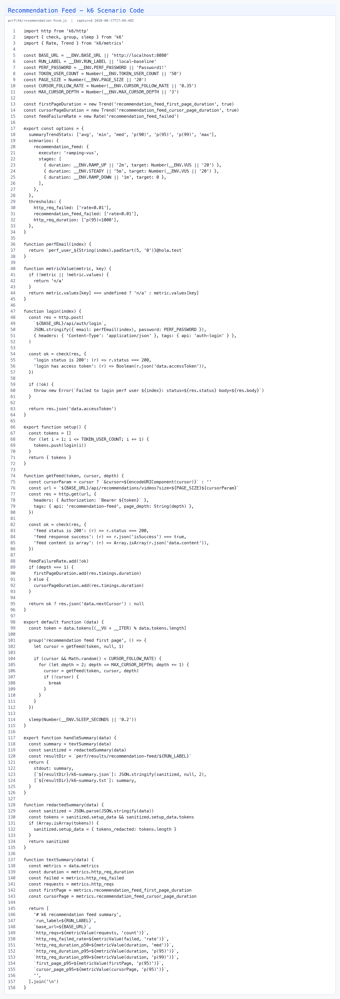

# Recommendation Feed Performance Report

## Summary

Target API:

```text
GET /api/recommendations/videos?size=20
```

Goal:

```text
Measure baseline p95/p99, identify PostgreSQL bottlenecks with EXPLAIN ANALYZE,
apply query or index improvements, and compare before/after evidence.
```

## Environment

| item | local baseline | before | after |
|---|---:|---:|---:|
| git commit |  |  |  |
| database | hola_perf | hola_perf | hola_perf |
| service | local Spring Boot | hola-backend-perf | hola-backend-perf |
| Cloud Run max instances | n/a | 1 | 1, then 2..3 |
| seed users | 10,000 | 10,000 | 10,000 |
| seed gyms | 1,000 | 1,000 | 1,000 |
| seed videos | 100,000 | 100,000 | 100,000 |
| seed follows | 300,000 | 300,000 | 300,000 |

## Local Baseline Evidence

### Code State


### k6 Summary


### SQL Plan


### k6 Scenario Code



## Before Evidence

### Code State


### Code Snapshot


### k6 Summary


### SQL Plan


### Grafana HTTP Latency


### Cloud Run Metrics


## After Evidence

### Code State


### Code Change


### k6 Summary


### SQL Plan


### Grafana HTTP Latency


### Cloud Run Metrics


## Result Table

| metric | local baseline | before | after | change |
|---|---:|---:|---:|---:|
| k6 p50 |  |  |  |  |
| k6 p95 |  |  |  |  |
| k6 p99 |  |  |  |  |
| error rate |  |  |  |  |
| total requests |  |  |  |  |
| SQL execution time |  |  |  |  |
| shared read buffers |  |  |  |  |

## Bottleneck

Describe the concrete SQL plan finding and link the screenshot next to the claim.

## Change

Describe the query, index, or application change and link the code screenshot next to the claim.

## Interpretation

Explain why the result changed and what remains risky.

## Evidence Files

Raw evidence directories:

```text
perf/results/recommendation-feed/local-baseline/
perf/results/recommendation-feed/before/
perf/results/recommendation-feed/after/
```

Every performance claim must link raw output and screenshots.
